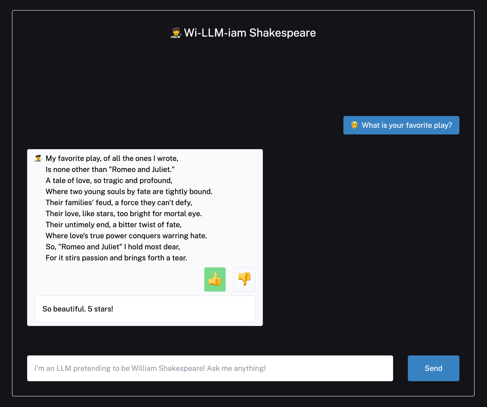

# LangSmith Next.js Chat UI Example

[](https://github.com/langchain-ai/langsmith-cookbook/tree/main/./feedback-examples/nextjs/README.md)


[](https://vercel.com/new/clone?repository-url=https%3A%2F%2Fgithub.com%2Flangchain-ai%2Flangsmith-cookbook%2Ffeedback-examples%2Fnextjs)

This template demonstrates how to use LangSmith tracing and feedback collection in a serverless TypeScript environment. It has only one page - a chat interface that streams messages and allows you to rate and comment on LLM responses.

[](https://langsmith-cookbook.vercel.app/)

Specifically, you'll be able to save user feedback as simple 👍/👎 scores attributed to traced runs, which you can then view in the LangSmith UI. Feedback can benefit LLM applications by providing signal for few-shot examples, model fine-tuning, evaluations, personalized user experiences, and improved application observability.

You can try out a live version of this repo here: https://langsmith-cookbook.vercel.app/

## Setup

After cloning this repo, copy the `.env.example` file into a new `.env.local` file and populate the following environment variables:

```
LANGCHAIN_TRACING_V2="true"
LANGCHAIN_ENDPOINT="https://api.smith.langchain.com"
LANGCHAIN_API_KEY="YOUR_LANGSMITH_API_KEY_HERE"
LANGCHAIN_PROJECT="YOUR_PROJECT_NAME_HERE"
OPENAI_API_KEY="YOUR_OPENAI_API_KEY_HERE"
```

Next, you'll need to install required dependencies by running e.g. `yarn` or `pnpm install` with your favorite package manger.

And that's it! Run `yarn dev` to start the app locally.

**Note:** By default, the app runs on port 3000. If you already have something running on that port, you can start this example by running `yarn dev --port <PORT-NUMBER>`

## Code Walkthrough

Now that you have the chat app running, let's take a look under the hood! There are three main components:

- An API route for generating the chat responses via a simple composed LangChain Expression Language chain
- The front-end chat window for rendering the chat messages and feedback dialog
- An API route for creating and updating user feedback on the interactions

There is also an inactive API route that shows how you could generating a public link to the trace if you wanted to include that information for the user of the app.

We'll hone in on these three main components, then discuss some generalizable tactics you can reuse in your own code!

### Chat Endpoint

The chat endpoint in [app/api/chat/route.ts](app/api/chat/route.ts) powers the conversation and contains the chain definition.

```typescript
const template = `...`
const model = new ChatOpenAI({
    temperature: 0.8,
});

const outputParser = new BytesOutputParser();

// Format the prompt, then format and pipe to a chat model,
// and stream output through an encoding output parser.
const chain = prompt.pipe(model).pipe(outputParser);
```

We compose the chain as a LangChain runnable to get streaming and tracing out of the box.
Normally, you'd be able to just pass the readable stream from calling `await chain.stream()` directly into the response object.
However, we need to extract the run's id in order to make further API calls and add feedback, so we wrap
it in a promise that resolves when the run id becomes available:

```typescript
let chainRunId;
const stream: ReadableStream = await new Promise((resolve) => {
  const chainStream = chain.stream(
    {
        chat_history: formattedPreviousMessages.join("\n"),
        input: currentMessageContent,
    },
    {
      callbacks: [
        {
          handleChainStart(_llm, _prompts, runId) {
            chainRunId = runId;
            resolve(chainStream);
          },
        },
      ],
    },
  );
});
```

We then return a streaming response below, setting the run ID in the header so the client can associate feedback with the correct run.

```typescript
return new Response(stream, {
  headers: {
    "x-langsmith-run-id": chainRunId ?? "",
  },
});
```

### Frontend

The frontend calls the above chat endpoint when a user submits a message. It handles the streaming response by
extracting the run id from the response headers and using it, along with the streamed chunks, to create a new message object
and add to its content as chunks stream in:

```typescript
const newMessages = [...messages, { role: "human" as const, content: input }];

setMessages(newMessages)
setIsLoading(true);
setInput("");

const response = await fetch(endpoint, {
  method: "POST",
  body: JSON.stringify({
    messages: newMessages
  })
});

const runId = response.headers.get("x-langsmith-run-id") ?? undefined;
const textDecoder = new TextDecoder();
const reader = response.body.getReader();

let chunk = await reader.read();

const aiResponseMessage: ChatWindowMessage = {
  content: textDecoder.decode(chunk.value),
  role: "ai" as const,
  runId,
};

setMessages([...newMessages, aiResponseMessage]);

while (!chunk.done) {
  chunk = await reader.read();
  aiResponseMessage.content += textDecoder.decode(chunk.value);
  setMessages([...newMessages, aiResponseMessage]);
}
```

Each `message` gets rendered as a React component with thumbs up and down buttons to give feedback:


Clicking one makes an API call to the route under `app/api/feedback/route.ts`. This route has two different endpoints,
one for creating new feedback models, and one for updating it, so the frontend accounts for both cases:

```typescript
const response = await fetch("api/feedback", {
  method: feedback?.id ? "PUT" : "POST",
  body: JSON.stringify({
    id: feedback?.id,
    run_id: runId,
    score,
    comment,
  })
});
```

You'll notice we need to pass in the `runId` we extracted earlier.

After a feedback session is created, the message opens a comment input to allow the user to go into greater detail:


### Feedback Endpoint

The feedback endpoint is actually two routes - one for creating new feedback sessions, and the other for updating existing ones.
Both are simple wrappers over LangSmith SDK calls. When the user first clicks the 👍/👎 button, feedback
is recorded with the following code. 

```typescript
const body = await req.json();
const runId = body.run_id;
const score = body.score;
if (!runId || isNaN(score)) {
  return NextResponse.json(
    { error: "You must provide a run id and a score." },
    { status: 400 },
  );
}
const feedback = await langsmithClient.createFeedback(runId, "user_score", {
  score,
});

return NextResponse.json({ feedback }, { status: 200 });
```

Then if they add a comment, the feedback is updated with by calling `updateFeedback`.
We we pass the feedback ID this time from the chat frontend to the update route through the request body.

```typescript
const body = await req.json();
const feedbackId = body.id;
const score = body.score;
if (!feedbackId) {
    return NextResponse.json(
    { error: "You must provide a feedback id" },
    { status: 400 },
    );
}
let correction;
let comment;
if (score === 1) {
    comment = body.comment;
} else {
    correction = { desired: body.comment };
}
await langsmithClient.updateFeedback(feedbackId, {
    score,
    comment,
    correction,
});
```

Once this is called, the run's feedback will contain the user score and comment!

## Learn More

To learn more about LangSmith, check out [the documentation](https://docs.smith.langchain.com).

## Deploy on Vercel

The easiest way to deploy your Next.js app is to use the [Vercel Platform](https://vercel.com/new?utm_medium=default-template&filter=next.js&utm_source=create-next-app&utm_campaign=create-next-app-readme) from the creators of Next.js.

Check out the [Next.js deployment documentation](https://nextjs.org/docs/deployment) for more details.

## Thank You!

<!-- markdown-link-check-disable -->
Thanks for reading! We hope this clarifies the TypeScript LangSmith feedback flow. If you have any questions or comments, reach out to us on Twitter [@LangChainAI](https://twitter.com/langchainai), or [click here to join our Discord server](https://discord.gg/langchain).
