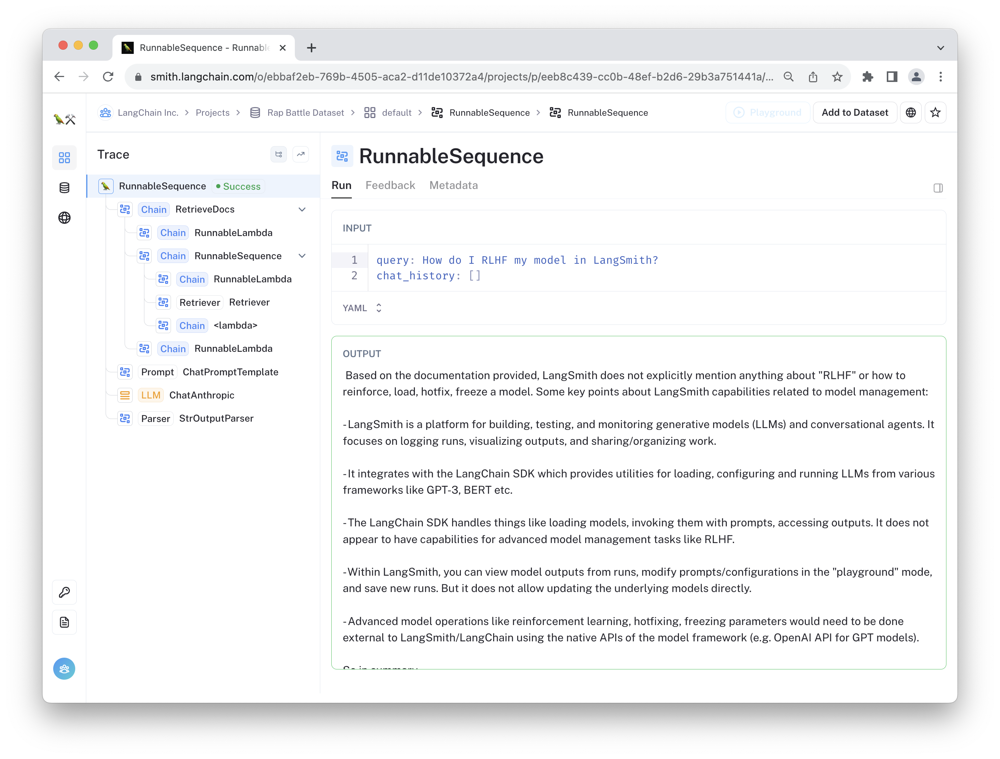
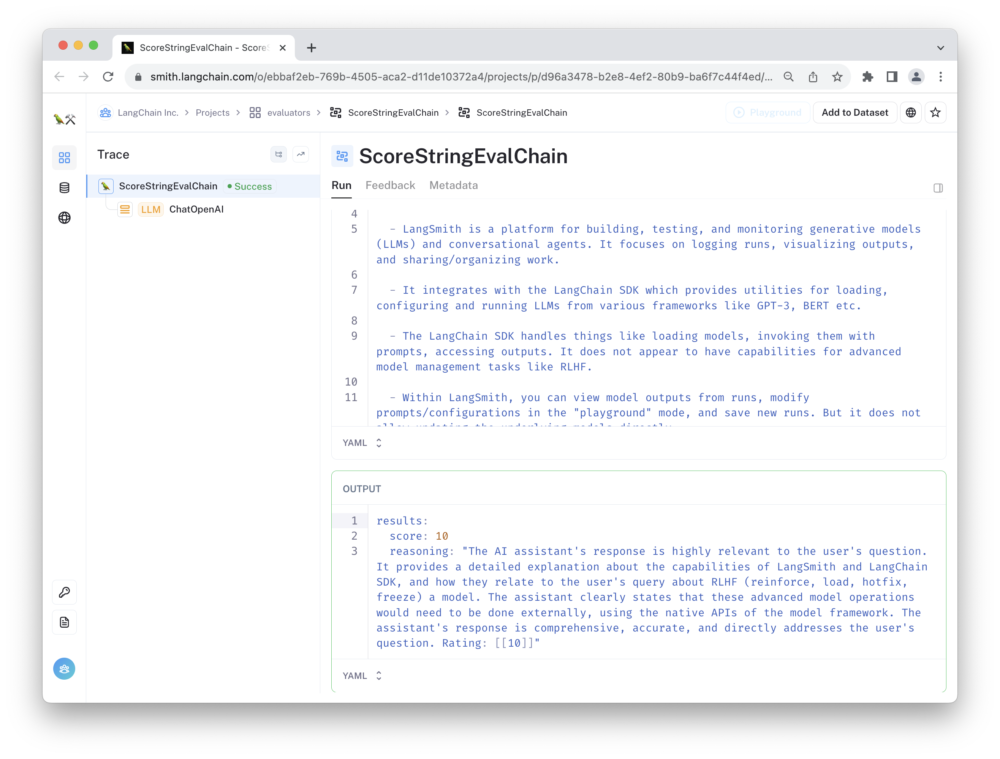
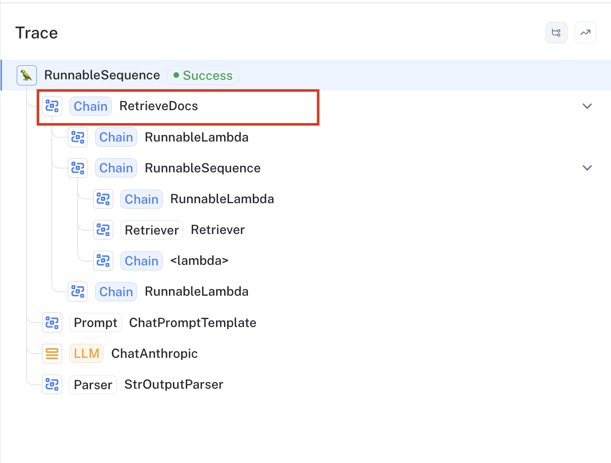
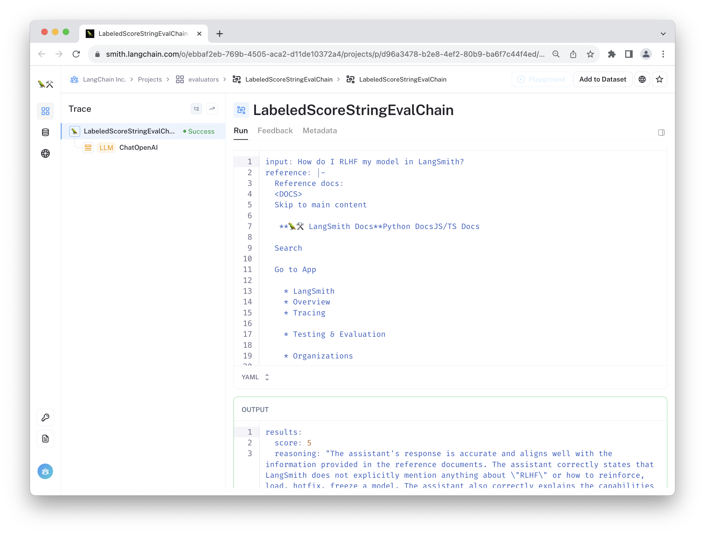

# Real-time RAG Chat Bot Evaluation

[](https://github.com/langchain-ai/langsmith-cookbook/tree/main/./feedback-examples/streamlit-realtime-feedback/README.md)


This tutorial shows how to catch model hallucinations in production using a custom run evaluator. This is a great way to
monitor the behavior of your RAG application to make sure the information in the final response is helpful and concordant with the retrieved knowledge. The technique outlined below enables non-blocking, online evaluation. This is appropriate for when you want up-to-date metrics on your application but do not want to further degrade the user experience whenever the bot is receiving low scores.

To do this, we create custom evaluator(s) (in our case, they both wrap [Scoring Evaluators](https://python.langchain.com/docs/guides/productionization/evaluation/string/scoring_eval_chain)) and register them as callbacks using the [EvaluatorCallbackHandler](https://api.python.langchain.com/en/latest/tracers/langchain_core.tracers.evaluation.EvaluatorCallbackHandler.html). The callback handler runs the evaluators in the background whenever your application is triggered to avoid interrupting the main program. You can view the feedback in the resulting run traces, as shown in the followin animation:


Below is a quick walkthrough.


## Prerequisites

The requirements for this streamlit application are listed in the [requirements.txt](./requirements.txt) file. 

(Recommended) First, create and activate virtual environment.
```bash
python -m pip install -U virtualenv pip
python -m virtualenv .venv
. .venv/bin/activate
```

Then install the app requirements.
```bash
python -m pip install -r requirements.txt
```

Next, configure your API keys for LangSmith and the LLM provider (we are using OpenAI for the evaluator LLM here and Anthropic for the application LLM).

```bash
export OPENAI_API_KEY=your-openai-api-key
export ANTHROPIC_API_KEY=your-anthropic-api-key
export LANGCHAIN_API_KEY=your-langsmith-api-key
```

Finally, start the streamlit application.

```bash
python -m streamlit run main.py
```

You can then ask the chat bot questions about LangSmith. Click the "View trace in 🦜🛠️ LangSmith" links after it responds to view the resulting trace. The evaluation feedback will be automatically populated for the run showing the predicted score. An example can be seen below or at [this link](https://smith.langchain.com/public/8e161a04-9a88-4b11-9569-2e627b7835c4/r).




## Evaluator definitions

In this example, we define two evaluators: a relevance evaluator and a faithfulness evaluator.

The relevance evaluator is instructed to grade the chat bot's response, taking into account the user's question and chat history. 

```python
class RelevanceEvaluator(RunEvaluator):
    def __init__(self):
        self.evaluator = load_evaluator(
            "score_string", criteria="relevance", normalize_by=10
        )

    def evaluate_run(
        self, run: Run, example: Optional[Example] = None
    ) -> EvaluationResult:
        try:
            text_input = (
                get_buffer_string(run.inputs["chat_history"])
                + f"\nhuman: {run.inputs['query']}"
            )
            result = self.evaluator.evaluate_strings(
                input=text_input, prediction=run.outputs["output"]
            )
            return EvaluationResult(
                **{"key": "relevance", "comment": result.get("reasoning"), **result}
            )
        except Exception as e:
            return EvaluationResult(key="relevance", score=None, comment=repr(e))

```

The evaluator selects the appropriate keys from the trace inputs and outputs and formats them in a way that is useful for the wrapped evaluator. One situation where this is useful is for when your bot becomes overly influenced by the content in the retrieved documents (e.g., a form of benign prompt injection). Since this evaluator does not consider the retrieved documents in its grade, it is easier for it to detect the shift. 

An example run of this evaluator run can be viewed [here](https://smith.langchain.com/public/e09d1d38-a480-4997-8c71-960c3372e438/r):



The second evaluator is a "faithfulness" evaluator, which penalizes cases where the chat bot includes contradictorhy or off-topic information in its response.

```python
class FaithfulnessEvaluator(RunEvaluator):
    def __init__(self):
        self.evaluator = load_evaluator(
            "labeled_score_string",
            criteria={
                "faithfulness": """
Score 1: The answer directly contradicts the information provided in the reference docs.
Score 3: The answer contains a mix of correct information from the reference docs and incorrect or unverifiable information not found in the docs.
Score 5: The answer is mostly aligned with the reference docs but includes extra information that, while not contradictory, is not verified by the docs.
Score 7: The answer aligns well with the reference docs but includes minor, commonly accepted facts not found in the docs.
Score 10: The answer perfectly aligns with and is fully entailed by the reference docs, with no extra information."""
            },
            normalize_by=10,
        )

    def evaluate_run(
        self, run: Run, example: Optional[Example] = None
    ) -> EvaluationResult:
        try:
            retrieve_docs_run = [
                run for run in run.child_runs if run.name == "RetrieveDocs"
            ][0]
            docs_string = f'Reference docs:\n<DOCS>\n{retrieve_docs_run.outputs["documents"]}</DOCS>'
            input_query = run.inputs["query"]
            prediction = run.outputs["output"]
            result = self.evaluator.evaluate_strings(
                input=input_query,
                prediction=prediction,
                reference=docs_string,
            )
            return EvaluationResult(
                **{"key": "faithfulness", "comment": result.get("reasoning"), **result}
            )
        except Exception as e:
            return EvaluationResult(key="faithfulness", score=None, comment=repr(e))
```

Since the retriever isn't called at the top level of the trace, this evaluator selects the appropriate run (span) by selecting the configured name of that component (represented by the "RetrieveDocs" chain in the trace image below). It then takes the formatted string containing the documents' page content, user query, and final chat bot response and passes these to the evalutor for grading.



An example run of this evaluator run can be viewed [here](https://smith.langchain.com/public/bf8d4bb8-3021-43a2-8497-126d681d7c2f/r):




## Use in LangChain

Once these are defined, we can add them to a callback handler and use it whenever we call our RAG chain by passing `config={"callbacks": [evaluation_callback]}` to any of the invoke, batch, or stream methods (or any of their async variants).

```python
evaluation_callback =  EvaluatorCallbackHandler(
    evaluators=[RelevanceEvaluator(), FaithfulnessEvaluator()]
)
CHAIN.stream(
        input_dict,
        config={
            "callbacks": [evaluation_callback],
        },
    ):
```

The evaluations will be run on an separate thread whenever the execution completes to avoid adding latency to the program and to ensure that any errors that occur during evaluation do not interrupt the program.


## Conclusion

Congratulations! Through this tutorial, you've learned how to set up real-time evaluation for your RAG chat bot to monitor its behavior in a production setting. By creating custom evaluators and registering them using the EvaluatorCallbackHandler, you have established a system to catch model hallucinations and ensure the information provided in the responses aligns well with the retrieved knowledge. This is particularly helpful when you want to maintain the quality of user interactions by having continuous, online feedback on your chat bot's performance without interrupting the main program. With the evaluators running in the background, you can now gain insights into the relevance and faithfulness of the chat bot's responses, making it a useful tool for further improvements.