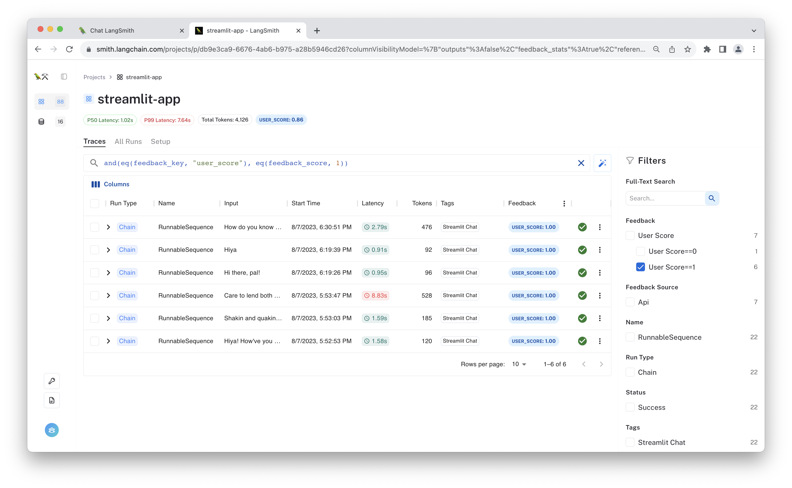
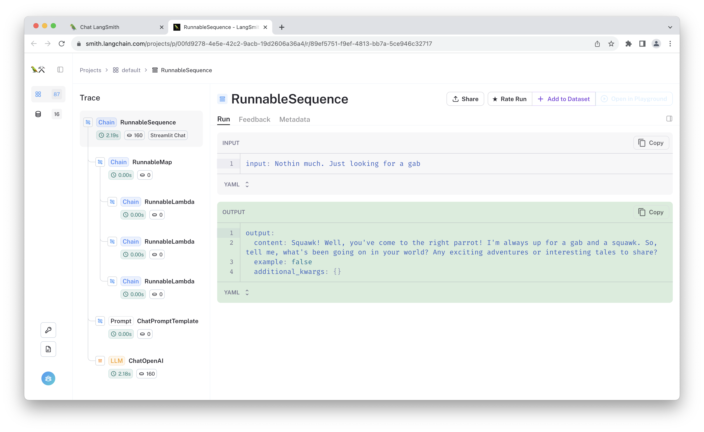
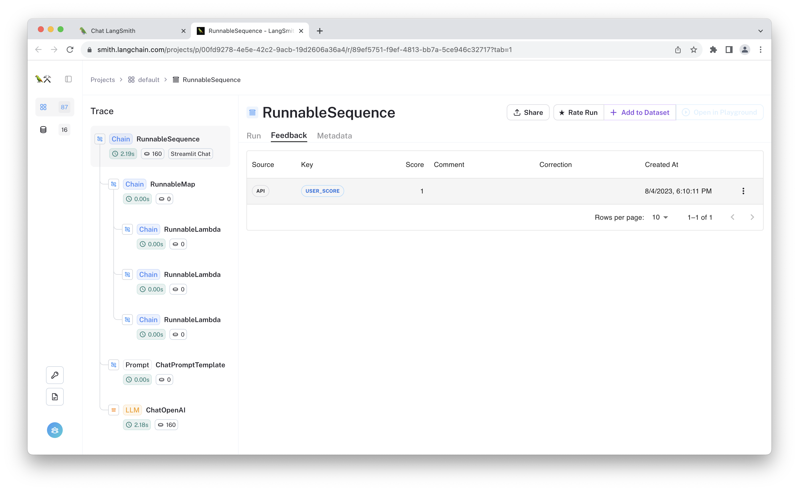

# Collect User Feedback in Streamlit

[](https://github.com/langchain-ai/langsmith-cookbook/tree/main/./feedback-examples/streamlit/README.md)


In this example, you will create a ChatGPT-like web app in Streamlit that supports streaming, custom instructions, app feedback, and more. The final app will look like the following:

<!-- markdown-link-check-disable -->
[](https://langsmith-chat-feedback.streamlit.app/)

In making this app, you will get to use:

- LangChain chains or runnables to handle prompt templating, LLM calls, and memory management
- LangSmith client to send user feedback and display trace links
- Streamlit runtime and UI components

In particular, you will save user feedback as simple 👍/👎 scores attributed to traced runs, then we will walk through how we can see it in the LangSmith UI. Feedback can benefit LLM applications by providing signal for few-shot examples, model fine-tuning, evaluations, personalized user experiences, and improved application observability. 

Now without further ado, let's get started!

## Prerequisites

To trace your runs and log feedback, you'll need to configure your environment to connect to [LangSmith](https://smith.langchain.com/). To do so, define the following environment variables:

```bash
export LANGCHAIN_TRACING_V2=true
export LANGCHAIN_ENDPOINT=https://api.smith.langchain.com
export LANGCHAIN_API_KEY=<your-api-key>
export LANGCHAIN_PROJECT=streamlit-demo
```

We'll be using OpenAI, so configure up your API key for them as well:

```python
export OPENAI_API_KEY=<your-openai-key>
```

Since we'll be installing some updated packages, we recommend using a virtual environment to run.

```bash
python -m virtualenv .venv
. .venv/bin/activate
```

Then, install the project requirements:

```bash
pip install -r requirements.txt
```

Finally, you should be able to run the app!

## Running the example

Execute the following command:

```bash
python -m streamlit run main.py
```

It should spin up the chat app on your localhost. Feel free to chat, rate the runs, and view the linked traces using the appropriate buttons! Once you've traced some interactions and provided feedback, you can try navigating to the `streamlit-demo` project (or whichever `LANGCHAIN_PROJECT` environment variable you have configured for this application), to see all the traces for this project.

The aggregate feedback is displayed at the top of the screen, alongside the median and 99th percentile run latencies. In this case, 86% of the runs that received feedback were given a "thumbs up."


You can click one of the auto-populated filters to exclusively view runs that received a positive or negative score, or you can apply other filters based on latency, the number of tokens consumed, or other parameters. 

Below, you can see we've filtered to only see runs that were given a "thumbs up" by the user.



Click one of the runs to see its full trace. This is useful for visualizing the data flow through the chain.

[](https://smith.langchain.com/public/1b571b29-1bcf-406b-9d67-19a48d808b44/r)


If you provided feedback to the selected run using one of the 👍/👎 buttons in the chat app, the "user feedback" will be visible in the "feedback" tab.

[](https://smith.langchain.com/public/1b571b29-1bcf-406b-9d67-19a48d808b44/r?tab=1)


You can add the run as an example to a dataset by clicking "+ Add to Dataset".


Before saving, feel free to modify the example outputs. This way you can ensure the dataset contains the "ideal" ground truth. This is especially useful if you are filtering by "thumbs down" examples and want to save "corrections" in a dataset.

## Code Walkthrough

The app consists of a main script managed by the `streamlit` event loop. Below are some key code snippets of what you've run.

After importing the required modules, you initialize the chat memory as a `StreamlitChatMessageHistory` memory object, which sets a "langchain_messages" key in the streamlit chat state.

```python
memory = ConversationBufferMemory(
    chat_memory=StreamlitChatMessageHistory(key="langchain_messages"),
    return_messages=True, # Used to use message formats with the chat model
    memory_key="chat_history",
)
```

Then you define the core logic of the chat model. This example lets you select between two equivalent chains: an LLMChain, and a chain built with LangChain's [expression language](https://python.langchain.com/docs/expression_language/).

#### Chat Chain

The simple chat bot is built using LangChain runnables and can be found in [expression_chain.py](expression_chain.py). It looks like the following:

```python
memory = ConversationBufferMemory(
    chat_memory=StreamlitChatMessageHistory(key="langchain_messages"),
    return_messages=True,
    memory_key="chat_history",
)
ingress = RunnableMap(
    {
        "input": lambda x: x["input"],
        "chat_history": lambda x: memory.load_memory_variables(x)["chat_history"],
        "time": lambda _: str(datetime.now()),
    }
)
prompt = ChatPromptTemplate.from_messages(
    [
        (
            "system",
            "You are a funky parrot pal. You are not an AI. You are a parrot."
            " You love poetry, reading, funk music, friendship, and squawking!"
            " It's currently {time}.",
        ),
        MessagesPlaceholder(variable_name="chat_history"),
        ("human", "{input}"),
    ]
)
llm = ChatOpenAI(temperature=0.7)
chain = ingress | prompt | llm
```

The expression language lets you compose different `Runnable` objects in a transparent way and provides sync/async, batch, and streaming methods that work end-to-end by default.


#### Chat Elements

Once you've defined the chat model, we define another code block to render the Streamlit Chat elements.

```python
for msg in st.session_state.langchain_messages:
    avatar = "🦜" if msg.type == "ai" else None
    with st.chat_message(msg.type, avatar=avatar):
        st.markdown(msg.content)
```

The logic for streaming the chain output to the app looks like this:

```python
if prompt := st.chat_input(placeholder="Ask me a question!"):
    st.chat_message("user").write(prompt)
    with st.chat_message("assistant", avatar="🦜"):
        message_placeholder = st.empty()
        full_response = ""

        input_dict = {"input": prompt}
        with collect_runs() as cb:
            for chunk in chain.stream(input_dict, config={"tags": ["Streamlit Chat"]}):
                full_response += chunk.content
                message_placeholder.markdown(full_response + "▌")
            memory.save_context(input_dict, {"output": full_response})
            run_id = cb.traced_runs[0].id
        message_placeholder.markdown(full_response)

```

This renders a `chat_input` container, which the user can type in for the next message. The LLM response is streamed back in the `message_placeholder` container, so it appears as if the bot is typing. Once the response completes, the values are saved to memory via `save_context`.

To assign feedback to this run, we need the reference the run's ID. We use the `collect_runs` context manager to do this. This captures the trace in memory so you can get the ID and pass it to the LangSmith client.

Finally, you can create feedback for the response directly in the app using the following code:

```python
if run_id:
    feedback = streamlit_feedback(
        feedback_type=feedback_option,
        optional_text_label="[Optional] Please provide an explanation",
        key=f"feedback_{run_id}",
    )

    # Define score mappings for both "thumbs" and "faces" feedback systems
    score_mappings = {
        "thumbs": {"👍": 1, "👎": 0},
        "faces": {"😀": 1, "🙂": 0.75, "😐": 0.5, "🙁": 0.25, "😞": 0},
    }

    # Get the score mapping based on the selected feedback option
    scores = score_mappings[feedback_option]

    if feedback:
        # Get the score from the selected feedback option's score mapping
        score = scores.get(feedback["score"])

        if score is not None:
            # Formulate feedback type string incorporating the feedback option
            # and score value
            feedback_type_str = f"{feedback_option} {feedback['score']}"

            # Record the feedback with the formulated feedback type string
            # and optional comment
            feedback_record = client.create_feedback(
                run_id,
                feedback_type_str,
                score=score,
                comment=feedback.get("text"),
            )
            st.session_state.feedback = {
                "feedback_id": str(feedback_record.id),
                "score": score,
            }
        else:
            st.warning("Invalid feedback score.")

```

This uses renders a thumbs up/down modal (or "faces" if the toggle is )

## Reusable Tactics

Below are some 'tactics' used in this example that you could reuse in other situations:

1. **Logging feedback with LangSmith client:** The LangSmith client is used to create and update feedback for each run. A simple form is thumbs up/down, but it also supports other `value`'s, `comment`'s, `correction`'s, and other input. This way, users and annotators alike can share explicit feedback on a run.

2. **Accessing URLs from saved runs:** The client also retrieves URLs for saved runs. It allows users to inspect their interactions, providing a direct link to LangSmith traces.

3. **LangChain Expression Language:** This example optionally uses LangChain's [expression language](https://python.langchain.com/docs/expression_language/) to create the chain and provide streaming support by default. It also gives more visibility in the resulting traces.

## Conclusion

The LangSmith Streamlit Chat UI example provides a straightforward approach to crafting a chat interface abundant with features. If you aim to develop conversational AI applications with real-time feedback and traceability, the techniques and implementations in this guide are tailored for you. Feel free to adapt the code to suit your specific needs.