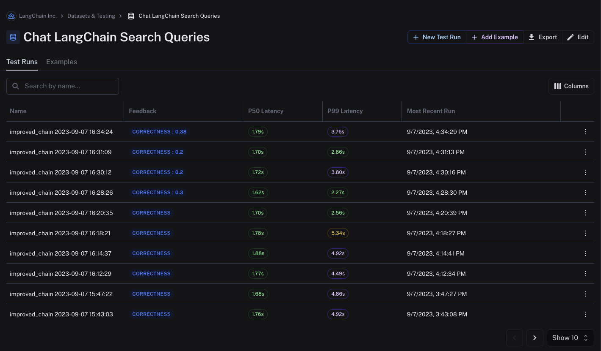

# Want to name your test runs? Here's how!
You can easily name langsmith test runs by setting the `project_name` parameter:

```python
def run_on_dataset(
    client: Client,
    dataset_name: str,
    llm_or_chain_factory: MODEL_OR_CHAIN_FACTORY,
    *,
    evaluation: Optional[RunEvalConfig] = None,
    concurrency_level: int = 5,
    project_name: Optional[str] = None,
    verbose: bool = False,
    tags: Optional[List[str]] = None,
    input_mapper: Optional[Callable[[Dict], Any]] = None,
    **kwargs: Any,
) -> Dict[str, Any]:
```

## Best practices
Naming should be in the form of "\<name of test\> {timestamp}". For example:

```python
project_name = f"improved_chain {datetime.datetime.now().strftime('%Y-%m-%d %H:%M:%S')}"

results = client.run_on_dataset(
        dataset_name=args.search_queries_dataset_name,
        project_name=project_name,
        llm_or_chain_factory=search_queries_chain,
        evaluation=eval_config_search_queries,
        verbose=True,
    )
```

This will result in named runs like so:

