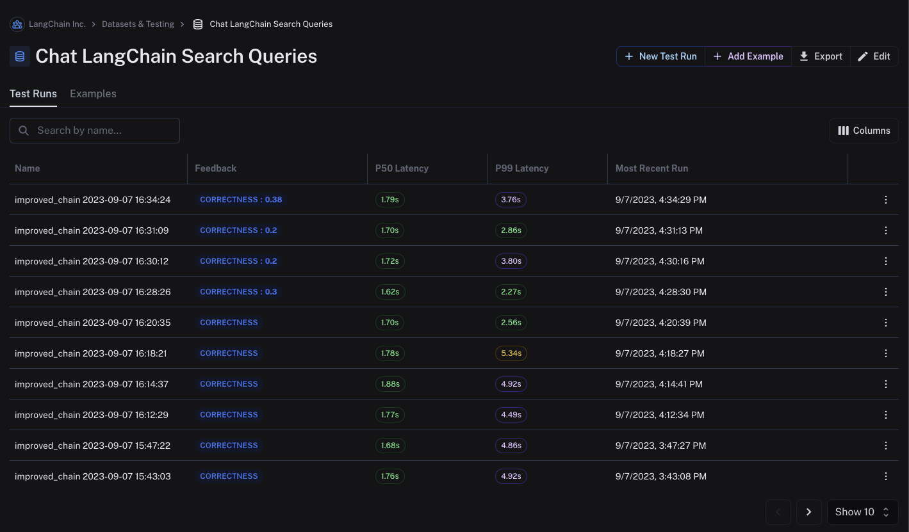

# Want to name your test runs? Here's how!

You can easily name LangSmith test projects by setting the `project_name` parameter. We recommend including a string identifier for the model/variant you are testing, along with a time-based component so that you can easily tell your test runs apart, e.g."\<prompt-123\> {timestamp}". For example:

```python
project_name = f"improved_chain {datetime.datetime.now().strftime('%Y-%m-%d %H:%M:%S')}"

results = client.run_on_dataset(
    ...
    project_name=project_name,
    ...
)
```

This will result in named runs like so:

