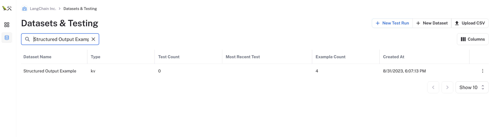
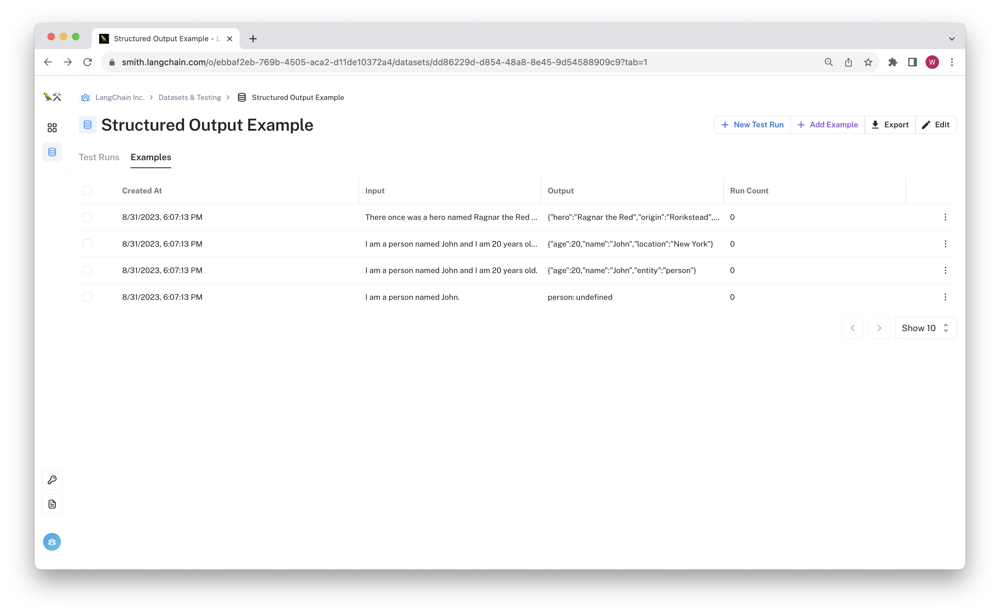

# Evaluating JS Chains in Python

This walkthrough is directed towards anyone using the LangChainJS package who wants to take advantage of LangSmith's datasets
and evaluation tooling. It applies the techniques discussed in the [Evaluating Existing Runs](../../testing-examples/evaluate-existing-test-project/evaluate_runs.ipynb) walkthrough
using a two-step process:

1. Generate chain predictions over the dataset, associating each trace with a dataset example (row).
2. Evaluate the test project in python, using your own custom evaluators or one of LangChain's off-the-shelf options.


Using this approach offers some benefits over the [simple assertions example](../simple-test/) in this repo, namely:
- Since each prediction is associated with a data point, you can track aggregate performance metrics over time as you make changes to your chain.
- You can use LangSmith to compare predictions on rows for more granular insights.
- You can take advantage of the larger python evaluation ecosystem without having to re-implement your chain in another language.

We don't (yet) have the full benchmarking functions written in TypeScript, but you can strike a reasonable compromise using this recipe.

The basic steps are:

1. Create the LangSmith dataset in your organization.
2. Run the JS test (`npm test`)

Since we have added a python command `python py/evaluate_project.py` to the [package.json](./package.json) file, this will automatically run and evaluate your chain!

Let's walk through the example in more detail:

## Prerequisites

Since we are using both JS and python environments, we will have to install requirements for both of those. First, install your npm requirements:

```bash
npm install --include=dev
```

Then configure your python environment. We recommend using a virtual environment to keep your dependencies in this directory.

```bash
python -m virtualenv .venv
. .venv
pip install -r requirements.txt
```

To access LangSmith, be sure to save your API key in the testing environment:

```bash
LANGCHAIN_API_KEY=<your-api-key>
```

Make sure you are using an API key for your organization to make sure your teammates can review the results as well.

## Upload the dataset

We have some example data stored in [upload_dataset.py](./py/upload_dataset.py). Run this script (once) to create the dataset.

```bash
python py/upload_dataset.py
```

If you navigate to the "Datasets & Testing" page in LangSmith and you can search for the "Structured Output Example" dataset and see the new dataset:



If you click on the dataset, you can see there are no test runs in the test runs tab, and each row can be viewed by clicking on the "Examples" tab:



With the dataset saved, it's time to run the evaluation.

## Run tests

Now you're ready to run the tests. Do so by running the following:

```bash
LANGCHAIN_PROJECT="UnitTests-$(git rev-parse --short HEAD)" npm test
```

This sets the default trace project for any runs to value you can associate with this git commit. The `test` command will run both the JS and python code, which we will explore in more detail below.

The chain being tested is defined in [index.ts](./src/index.ts). It is instructed to extract json structured output from input text.
The test file in [index.test.ts](./tests/index.test.ts) contains a single 'test' that just runs the chain over the dataset examples. The code is reproduced below:

```typescript
function getConfigs(examples: Example[], projectName?: string) {
  return examples.map((example) => {
    return {
      callbacks: [new LangChainTracer({ exampleId: example.id, projectName })],
    };
  });
}

const datasetName = "Structured Output Example";
test(`"Test run on ${datasetName}`, async () => {
  const client = new Client();
  const chain = getChain();
  const examples: Example[] = [];
  for await (const example of client.listExamples({ datasetName })) {
    examples.push(example);
  }
  // You can pick a useful name for your project here that is easy to
  // use when evaluating in python
  const projectName =
    (process.env.LANGCHAIN_PROJECT ?? "Unit Testing") + datasetName;
  const configs = getConfigs(examples, projectName);
  const chainInputs = examples.map((example) => example.inputs);
  await chain.batch(chainInputs, configs);
}, 60_000);

```

We are using Jest's `test` function to run, and giving it a healthy timeout of 1 minute. You can adjust this based on your dataset size and chain complexity.
The key steps in this test are:
1. Fetch the examples from the test dataset.
2. Create callbacks configs for each example in the batch. This does two things:
- assigns the reference example ID of the dataset row to the resulting run trace.
- saves the traces in a project unique to this 'test'. If you want test your chain over multiple datasets, setting the project name consistently is important to make sure results are organized by dataset.
3. Batch run the chain on the inputs. This will execute the runs with some level of concurrency to speed up the process.

The results will all be traced to LangSmith and associated with the dataset you uploaded in the previous step.
Once that is uploaded, the testing command will execute the python script in [evaluate_project.py](./py/evaluate_project.py)

Let's review the evaluation code below. The main connecting logic is defined in `evaluate_existing_project`:

```python
def evaluate_existing_project(project_name: str):
    client = Client()
    runs = client.list_runs(project_name=project_name, execution_order=1)
    evaluator = JsonValueDistance()
    batched_evaluator = RunnableLambda(
        lambda run: client.evaluate_run(run, evaluator=evaluator)
    )
    all_feedback = batched_evaluator.batch(list(runs))
    scores = [feedback.score for feedback in all_feedback if feedback.score is not None]
    print(f"Average score: {sum(scores) / len(scores)}")


if __name__ == "__main__":
    dataset_name = "Structured Output Example"
    project_name = os.environ.get("LANGCHAIN_PROJECT", "Unit Testing") + dataset_name
    evaluate_existing_project(project_name=project_name)
```

The script does the following:
1. Select the test project to evalute based on the same naming convention included in [index.ts](./src/index.ts)
2. List the runs in the project
3. Calls `client.evaluate_run` on each run, applying a custom evaluator (more info below) to generate the feedback.
- (optional) We are using a RunnableLambda to help parallelize this call, but you could run it in a normal for loop.

The custom evaluator is defined below:

```python
class JsonValueDistance(RunEvaluator):
    def __init__(self) -> None:
        super().__init__()
        self.distance_evaluator = evaluation.load_evaluator("string_distance")
        self.eval_name = "json_string_similarity"

    def evaluate_run(
        self, run: Run, example: Optional[Example] = None
    ) -> EvaluationResult:
        """Evaluate an example."""
        if run.outputs is None:
            raise ValueError("Run outputs cannot be None")
        prediction = next(iter(run.outputs.values()))
        reference = next(iter(example.outputs.values()))
        if not reference:
            return EvaluationResult(
                key=self.eval_name, score=None, comment="No reference"
            )
        try:
            obj = json.loads(prediction)
        except Exception as e:
            return EvaluationResult(key=self.eval_name, score=0.0, comment=str(e))
        distances = []
        for key in reference:
            if key in obj:
                norm_distance = self.distance_evaluator.evaluate_strings(
                    prediction=str(obj[key]), reference=str(reference[key])
                )["score"]
            else:
                norm_distance = 1.0
            distances.append(norm_distance)
        return EvaluationResult(
            key=self.eval_name, score=1.0 - sum(distances) / len(distances)
        )
```

This is meant to illustrate how you can apply custom logic to the traced run to generate a score. In this case, the evaluator checks for the average string distance for each value in a parsed json dictionary. A value of 1 means that all the reference keys have values that are approximately equal. A value of 0 means the json was invalid or the strings don't have overlap.

Once the test script is executed, the evaluation results will be assigned to your JS test project! You can click on the "Test Runs" tab of the "Structured Output Example" dataset to view the results.


(note: it may take up to a minute for the results to appear. Thank you for your patience!) 

Below is an example test test project generated by running the testing command:

[img](img/test_run.png)

In this case, the results are reasonably high, but it looks like it got an imperfect score on one of the examples.

[Failed example](./img/erroneous_value.png)

Clicking through to the trace, you can see that the generated key "entity_type" doesn't match the expected key. We could likely fix this in our chain by specifying the desired function schema or grammar or by improving our model's instructions.

## Conclusion

In this walkthrough, you created a LangSmith dataset and evaluated your LangChainJS chain over each row. You generate benchmark metrics using a custom python evaluator and applied it to each prediction in the test project. Now that you have results from this chain, you can decide on quality thresholds to set and begin to assign assertions to ensure that your chain doesn't regress in performance.