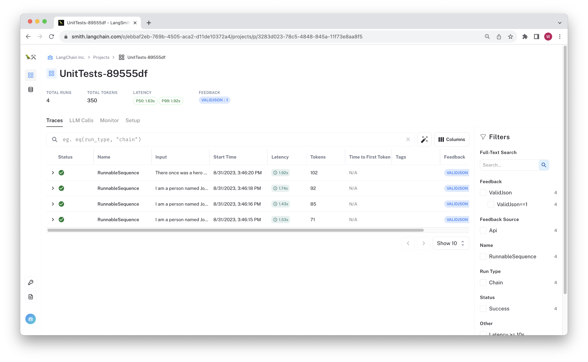

# Logging Assertions as Feedback

This walkthrough shows a lightweight way to begin using langsmith feedback in TypeScript, without having to change many lines of code
in your existing tests. It works by logging testing assertions in an existing javascript testing framework as evaluation feedback.

We don't (yet) have full benchmarking functions written in TypeScript, and you may already have some tests using
familiar testing harnesses like Jest or Mocha. You can still track your tests in LangSmith and associate the assertion results
with the run traces to easily debug changes in chain behavior.

The basic steps are:

1. Run your chain on example data, capturing the run IDs for each run.
2. Perform your assertions, catching and logging the result.

We recommend creating a new test project each time CI is run. One pattern that could facilitate this is naming the
project using the git hash, such as:

```bash
LANGCHAIN_PROJECT="UnitTests-$(git rev-parse --short HEAD)" npm test
```

An example of the resulting project is:

